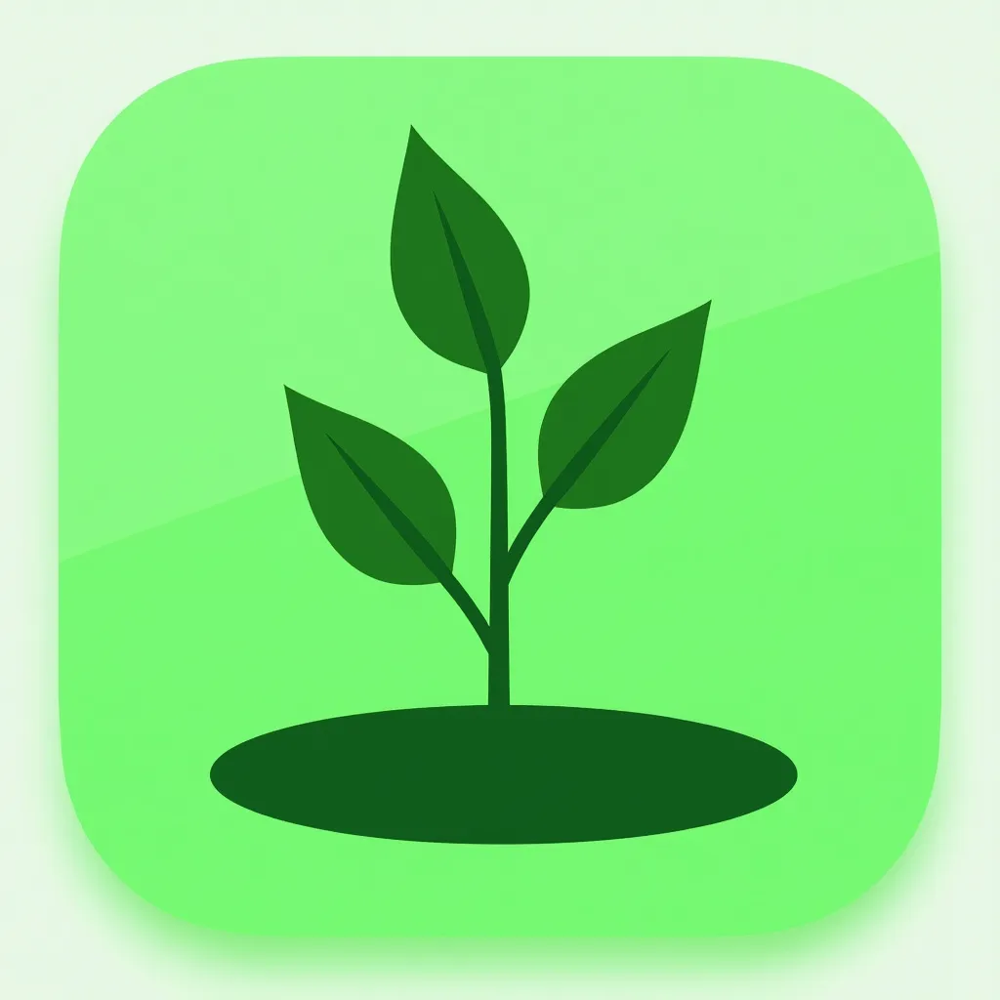

# PlantPal 🌱

PlantPal is a comprehensive mobile application that helps users manage their plant care routine, track plant health, set reminders for watering and fertilizing, and access plant care information.

<p align="center">
  
</p>

## 📋 Features

- **Beautiful User Interface**: Modern, animated UI with intuitive navigation
- **Plant Tracking**: Add and manage your plant collection with detailed information
- **Care Reminders**: Set and receive notifications for watering, fertilizing, rotation, and more
- **Weather Integration**: Access local weather information to optimize plant care
- **Plant Encyclopedia**: Browse through plant types with care instructions
- **User Profiles**: Create an account to sync your plant data across devices
- **Dark/Light Mode**: Choose your preferred theme for the app

## 🚀 Tech Stack

- **Frontend**: React Native, Expo
- **State Management**: Redux Toolkit
- **Backend & Auth**: Supabase
- **Storage**: Supabase Storage
- **Notifications**: Expo Notifications
- **UI Components**: Custom components with Expo LinearGradient, Blur effects
- **Icons & Images**: React Native Vector Icons, Custom assets

## 📱 Screenshots

<p align="center">
  
  
  
</p>

## 🛠️ Installation & Setup

### Prerequisites

- Node.js (v16+)
- npm or yarn
- Expo CLI
- iOS Simulator/Android Emulator (optional)

### Environment Setup

1. Clone the repository:
   ```bash
   git clone https://github.com/yourusername/PlantPal.git
   cd PlantPal
   ```

2. Install dependencies:
   ```bash
   npm install
   ```

3. Create a `.env` file in the project root and add your Supabase credentials:
   ```
   SUPABASE_URL=your_supabase_url
   SUPABASE_ANON_KEY=your_supabase_anon_key
   ```

4. Get a Trefle API token:
   - Create an account at [Trefle.io](https://trefle.io)
   - Confirm your email address
   - Log in to your account
   - Obtain your Trefle API token
   - Add it to your `.env` file:
   ```
   TREFLE_API_TOKEN=your_trefle_api_token
   ```

5. Start the development server:
   ```bash
   npm start
   ```

6. Follow the on-screen instructions to open the app in Expo Go on your device or an emulator.

## 📚 Project Structure

```
PlantPal/
├── assets/               # App images and assets
├── src/
│   ├── components/       # Reusable UI components
│   ├── context/          # React Context providers
│   ├── navigation/       # Navigation configuration
│   ├── screens/          # App screens
│   ├── services/         # API and other services
│   ├── store/            # Redux store and slices
│   └── utils/            # Helper functions
├── App.js                # Main app component
├── app.json              # Expo configuration
├── babel.config.js       # Babel configuration
└── package.json          # Dependencies
```

## 🔧 Configuration

### Supabase Setup

The app uses Supabase for backend services. To configure:

1. Create a Supabase project at [https://supabase.com](https://supabase.com)
2. Set up the following tables in your Supabase database:
   - `plants` - User's plants
   - `plant_types` - Plant encyclopedia information
   - `reminders` - User's care reminders
   - `weather_data` - Cached weather information
3. Create storage buckets for plant images and user avatars
4. Add your Supabase URL and anon key to the `.env` file

### Trefle API Setup

The app uses the Trefle API for plant data:

1. Create an account at [Trefle.io](https://trefle.io)
2. Log in and obtain your personal access token
3. Add your Trefle API token to the `.env` file
4. The app will now be able to access plant information from the Trefle database

### Notifications

The app uses Expo's notification system:

1. Configure the correct notification permissions in app.json
2. For production, set up push notification credentials for iOS and Android

## 💡 Usage

1. Create an account or login
2. Browse the plant encyclopedia or add your own plants
3. Set up care reminders for each plant
4. Receive notifications when it's time to water or care for your plants
5. Track your plant growth by adding photos and notes
6. Check the weather integration for plant-care advice

## 🔄 Development Workflow

### Running the App

```bash
# Start the development server
npm start

# Run on iOS
npm run ios

# Run on Android
npm run android
```

### Building for Production

```bash
# Using EAS Build (recommended)
eas build --platform ios
eas build --platform android

# Using Expo's classic build system
expo build:ios
expo build:android
```

## 🔑 Authentication

PlantPal uses Supabase Authentication with support for:
- Email/Password
- Coming soon: Google, Apple, and Facebook login

## 📄 License

This project is licensed under the MIT License - see the LICENSE file for details.

## 👥 Contributors

- Ramesh Kolukuluri - Lead Developer

## 🙏 Acknowledgements

- Expo team for the excellent React Native framework
- Supabase for backend services
- Icons made by [Various Artists](https://www.flaticon.com)
- Plant data and images from various open sources

---

## 🌿 Happy Plant Growing!

For questions or support, please contact plantpal.support@example.com 